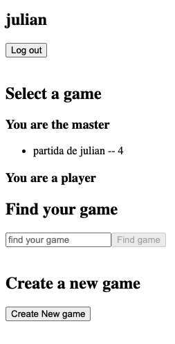
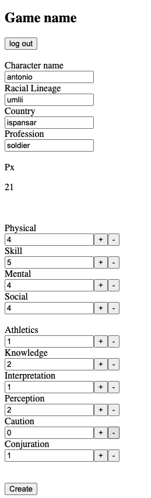

# Magic & Phoenix Character Sheet App

Magic & Phoenix is a rol game, developed by my good friend Nacho Pérez Sanchez. This App, consist in the
management, and creating of the game's character Sheets. Where you can set your profile, update and interact
with your benevolent (or maybe not so much) master.

The project is not yet finished, but is the best i could in a week!! anyway it will really improve soon.

If you want to know a little bit more about M&P, you can check our web "https://magicandphoenix.com"

`Have fun creating your characters and updating then!`


## Starting 🚀


This project has a backend application developed in Java with Spring Boot. It has 3 microservices:
characterSheetService-dev, gameService-dev and userService-dev. The userService-dev, act at the moment
as edge service, but this should be also update in future.

Tere is also a frontend application developed in Angular. 

Both applications communicate with each other through an API.

### Installation 🔧
---

These instructions will allow you to get a copy of the project running on your local machine.

1. Download the project from the repository.

2. Create three MySQL schemas in your local dataBase by running the commands;

```
CREATE SCHEMA users_from_magic_and_phoenix_app;
CREATE SCHEMA game;
CREATE SCHEMA character_sheet;

```
Once the schema users_from_magic_and_phoenix_app is created, ant the proyect is running you have to insert the 
rol ROLE_User, into the table roles_table. to do it, use the next command

```
insert into roles_table(name) VALUE ('ROLE_USER');
```

If you don't want to create the schemas, you can also execute the .sql files into the resources folder of
any microservice.

The microservices can be found into backend folder.
The characterSheetService-dev run into the port http://localhost:8080, game into http://localhost:8081
and users_from_magic_and_phoenix_app into the port http://localhost:8080

3. Go to this repository's application.properties file and replace these lines with your mySQL username and password.

```
'spring.datasource.username=username' and 'spring.datasource.password=password'
```

4. Execute the microservices (also the eureka-server), so they can work together to form the full API

```
mvn spring-boot:run
```

6. Open magic-and-phoenix (inside frontend) application with Visual Studio Code and run this command to lift the application in angular.

```
ng serve -o
```

7. Go to your browser and type the following path to open the project.

```
http://localhost:4200/
```


_Ready! create your profile, login and create games, join games, create of update characters sheet, etc, etc...

# Diagrams
Case Diagram


# Screenshots








---
⌨️ developed️ by Antonio Navarro